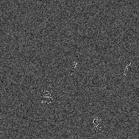

# Generate MNIST for Object Detection

Generates a dataset which can be used to practice object detection, since it generates small (128x128) images by placing MNIST images randomly on a black canvas.

Notebook [generate_mnist_boxes.ipynb](generate_mnist_boxes.ipynb) draws MNIST data on a black canvas of 128x128.
The example images of a dataset are shown below.

